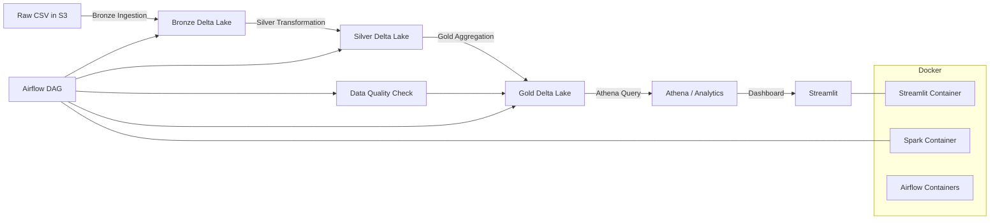
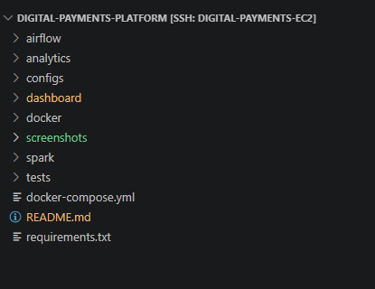
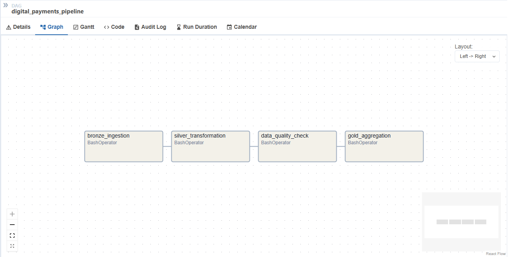

# Digital Payments Fraud Detection Data Engineering Platform

## Project Overview

This repository implements a production-grade Delta Lakehouse pipeline for digital payments fraud analytics. The solution ingests PaySim-style transaction CSVs from AWS S3, processes them through Bronze, Silver, and Gold layers using PySpark and Delta Lake, orchestrates execution with Apache Airflow, validates data quality, and exposes business metrics through AWS Athena and a Streamlit dashboard.

## Business Problem

Financial operations teams need a robust pipeline that can:

- ingest large volumes of transaction data from S3,
- enforce data quality and auditability,
- enrich and deduplicate transaction records,
- compute daily fraud and risk analytics,
- and serve analytics to business users via Athena and dashboarding.

This project addresses fraud monitoring and pipeline reliability for digital payment transactions.

## Solution Architecture

[IMAGE_PLACEHOLDER_ARCHITECTURE]



## Technology Stack

| Technology | Purpose |
|---|---|
| Python | ETL orchestration and utility code |
| PySpark | Spark job development |
| Apache Spark | Distributed processing engine |
| Delta Lake | Transactional lakehouse storage |
| Apache Airflow | Workflow orchestration |
| Docker | Containerized runtime |
| AWS S3 | Raw and Delta storage layer |
| AWS Athena | SQL analytics over Gold layer |
| PostgreSQL | Airflow metadata database |
| Streamlit | Analytics dashboard UI |
| awswrangler | Athena query integration |
| boto3 | AWS SDK for Python |
| PyYAML | Configuration loading |
| pytest / chispa | Unit testing |

## Project Architecture

[IMAGE_PLACEHOLDER_DATA_FLOW]

The architecture follows a medallion design:

- Raw CSV files land in S3.
- A Bronze Spark job ingests and stores raw records in Delta format.
- A Silver Spark job validates, quarantines, enriches, and upserts clean records.
- A Gold Spark job aggregates daily fraud metrics.
- Airflow orchestrates the pipeline and handles retries.
- Athena and Streamlit visualize the Gold layer results.

## Repository Structure

```text
.digital-payments-platform/
├── .github/
│   └── workflows/ci-cd.yml
├── airflow/
│   ├── docker-compose.yml
│   └── dags/payment_pipeline_dag.py
├── analytics/
│   └── table_reference.md
├── configs/
│   └── dev.yaml
├── dashboard/
│   ├── app.py
│   ├── requirements.txt
│   └── utils/athena_client.py
├── docker/
│   └── Dockerfile
├── spark/
│   ├── bronze/bronze_ingestion.py
│   ├── silver/silver_transformation.py
│   ├── gold/gold_aggregation.py
│   ├── schemas/transaction_schema.py
│   ├── schemas/metadata_schema.py
│   └── utils/
│       ├── audit_logger.py
│       ├── config_loader.py
│       ├── dq_check.py
│       ├── logger.py
│       ├── spark_session.py
│       └── validators.py
├── tests/
│   ├── conftest.py
│   └── test_validators.py
├── docker-compose.yml
├── requirements.txt
└── README.md
```

## Data Pipeline Overview

### Data Ingestion

- `spark/bronze/bronze_ingestion.py` scans `s3a://digital-payments-kiran/raw/paysim/transactions/`.
- It uses Hadoop S3A and a strict schema from `spark/schemas/transaction_schema.py`.
- New files are detected by comparing against a Bronze metadata Delta table.
- Each record receives `transaction_id`, `ingestion_timestamp`, `processing_timestamp`, `source_file`, and `ingestion_date`.

### Bronze Layer

- Writes raw records to Delta Lake at `s3a://digital-payments-kiran/bronze/paysim/transactions/`.
- Uses `partitionBy("ingestion_date")` for partition pruning.
- Maintains a Delta metadata tracker at `s3a://digital-payments-kiran/metadata/bronze_file_tracker/`.
- Writes audit events to `s3a://digital-payments-kiran/audit/pipeline_runs/`.

### Silver Layer

- `spark/silver/silver_transformation.py` reads the Bronze Delta table.
- It uses a watermark from `s3a://digital-payments-kiran/metadata/silver_file_tracker/` to process incremental updates.
- Validation rules identify bad records and append them to a quarantine Delta path.
- Clean records are transformed, deduplicated, and upserted into `s3a://digital-payments-kiran/silver/paysim/transactions/`.

### Gold Layer

- `spark/gold/gold_aggregation.py` reads Silver Delta data incrementally using a Gold watermark.
- Aggregates daily fraud metrics by `ingestion_date`.
- Writes results to `s3a://digital-payments-kiran/gold/paysim/fraud_daily_summary/`.
- The Gold table is partitioned by `year_month` for analytics efficiency.

## Transformation Logic

Silver layer transformations include:

- `type` → `transaction_type`
- `nameOrig` → `sender_id`
- `nameDest` → `receiver_id`
- Numeric casting for `step`, `amount`, balances, and fraud flags
- Upper-casing of `transaction_type`
- Feature engineering:
  - `sender_balance_diff`
  - `receiver_balance_diff`
  - `is_full_depletion`
  - `is_high_value` (amount > 200000)
  - `type_risk` for `TRANSFER` and `CASH_OUT`
  - `risk_score`
- Duplicate removal by `transaction_id`

Gold layer aggregations include:

- total transactions
- unique senders and receivers
- total frauds and flagged frauds
- fraud rate and fraud ratio percent
- total transaction value
- fraud amount and average fraud amount
- high value transaction count
- cash out and transfer counts
- average and maximum risk score

## Delta Lake Implementation

### ACID Transactions

- All storage layers use Delta Lake for transactional writes.
- Spark jobs use `format("delta")` and Delta APIs for reads/writes.

### Upserts / MERGE Operations

- Bronze metadata updates use `DeltaTable.merge` to maintain file status.
- Silver layer performs upserts using a Delta merge on `transaction_id`.
- Gold layer merges by `ingestion_date` to update daily metrics.

### Partitioning Strategy

- Bronze: `partitionBy("ingestion_date")`
- Silver: initially partitioned by `ingestion_date` on first write
- Gold: partitioned by `year_month` for time-series query performance

### Schema Evolution Handling

- `mergeSchema=true` is used for Delta writes.
- Spark config enables `spark.databricks.delta.schema.autoMerge.enabled=true`.
- This allows incremental schema changes during writes.

## Airflow Orchestration

### DAG Design
- DAG ID: `digital_payments_pipeline`
- Schedule: `@daily`
- Start date: `2024-01-01`
- Catchup: `False`
- Max active runs: `1`
- Concurrency: `4`
- Dag run timeout: `2h`

### Task Dependencies

```text
bronze_ingestion >> silver_transformation >> data_quality_check >> gold_aggregation
```

### Task Implementation
{}
- `Bronze Ingestion`: Spark submit `spark/bronze/bronze_ingestion.py`
- `Silver Transformation`: Spark submit `spark/silver/silver_transformation.py`
- `Data Quality Check`: Spark submit `spark/utils/dq_check.py`
- `Gold Aggregation`: Spark submit `spark/gold/gold_aggregation.py`

All tasks run inside the Docker Spark container via `docker exec spark-delta-engine`.

### Scheduling & Retry Strategy

- Each task retries up to `3` times.
- Retry delay: `5` minutes.
- Email notifications enabled on failure.
- Success/failure callbacks log task state.



## Data Quality Framework

### Validation Checks

Implemented in `spark/utils/validators.py`:

- `validate_positive_amount` (amount <= 0)
- `validate_null_transaction_id` (missing `step`, `nameOrig`, or `nameDest`)
- `validate_balance` (negative or invalid balances)
- `validate_transaction_type` (only allowed PaySim transaction types)

### Null Checks

- Ensures required business keys are present instead of raw transaction IDs.

### Duplicate Checks

- Removes duplicates in Silver using `dropDuplicates(["transaction_id"])`.

### Business Rule Validations

- Invalid transaction types are quarantined.
- Negative balances and zero/negative amounts are quarantined.
- Bad records are written to a Delta quarantine path.

### DQ Enforcement

- `spark/utils/dq_check.py` evaluates the latest Silver validation metrics.
- The configured failure threshold is `0.05`.
- If `failure_rate` exceeds the threshold, the task fails.

## AWS Architecture

### S3 Bucket Structure

Configured in `configs/dev.yaml` and documented in `analytics/table_reference.md`:

- Raw: `s3a://digital-payments-kiran/raw/paysim/transactions/`
- Bronze: `s3a://digital-payments-kiran/bronze/paysim/transactions/`
- Silver: `s3a://digital-payments-kiran/silver/paysim/transactions/`
- Gold: `s3a://digital-payments-kiran/gold/paysim/fraud_daily_summary/`
- Quarantine: `s3a://digital-payments-kiran/quarantine/paysim/transactions/`
- Audit logs: `s3a://digital-payments-kiran/audit/pipeline_runs/`
- Validation metrics: `s3a://digital-payments-kiran/audit/validation_metrics/`
- Athena output: `s3://digital-payments-kiran/athena_results/`

### Athena Integration

- Dashboard queries Athena using `awswrangler`.
- Athena database name: `digital_payments_analytics`.
- Gold table referenced: `gold_fraud_daily_summary`.

### Glue Integration

- AWS Glue is not explicitly implemented in this repository.
- Athena integration relies on a configured database name and S3 location.

### IAM Considerations

The repository assumes AWS credentials are supplied via environment variables. Access requirements include:

- S3 read/write to raw, bronze, silver, gold, quarantine, audit, and Athena output locations
- Athena query execution privileges
- ECR push/pull and EC2 deployment privileges in CI/CD

[IMAGE_PLACEHOLDER_AWS_SERVICES]

## How to Run Locally

### Prerequisites

- Docker
- Docker Compose
- AWS credentials set in `.env`
- Python dependencies installed inside image via `docker/Dockerfile`

### Local Startup

1. Copy or populate `.env` with:

```bash
AWS_ACCESS_KEY_ID=...
AWS_SECRET_ACCESS_KEY=...
AWS_REGION=...
```

2. Start Spark and dashboard containers:

```bash
docker compose up -d
```

3. Start Airflow services:

```bash
docker compose -f airflow/docker-compose.yml up -d
```

4. Access services:

- Airflow UI: `http://localhost:8080`
- Streamlit dashboard: `http://localhost:8501`

## Environment Variables

Required environment variables:

- `AWS_ACCESS_KEY_ID`
- `AWS_SECRET_ACCESS_KEY`
- `AWS_REGION`
- `ENV` (optional, defaults to `dev`)

Additional Airflow runtime variables are configured in `airflow/docker-compose.yml`.

## Running the Pipeline

### Docker Startup

```bash
docker compose up -d
```

### Airflow Startup

```bash
docker compose -f airflow/docker-compose.yml up -d
```

### Trigger DAG

```bash
docker exec airflow-webserver airflow dags trigger digital_payments_pipeline
```

### Manual Spark Execution

```bash
docker exec spark-delta-engine spark-submit /app/spark/bronze/bronze_ingestion.py
```

### Monitoring Execution

- Check Airflow DAG runs in the Airflow UI.
- Inspect Spark logs under `/app/logs` in the container.
- Review Delta audit logs in S3 audit paths.

## Sample Outputs

[IMAGE_PLACEHOLDER_BRONZE_OUTPUT]

[IMAGE_PLACEHOLDER_SILVER_OUTPUT]

[IMAGE_PLACEHOLDER_GOLD_OUTPUT]

[IMAGE_PLACEHOLDER_ATHENA_RESULTS]

## Performance Optimizations

- `spark.sql.shuffle.partitions=4`
- `repartition(4)` before Delta writes and aggregations
- `StorageLevel.MEMORY_AND_DISK` caching in Bronze, Silver, and Gold jobs
- Delta optimized writes enabled
- Delta auto compact enabled
- Partitioning by `ingestion_date` and `year_month`
- Streaming dashboard caching with `st.cache_data(ttl=60)`

## Monitoring and Logging

- Custom Python logger writes to `/app/logs`.
- Audit events are written as Delta tables for pipeline runs.
- Airflow uses email alerts and callback logging.
- Streamlit dashboard auto-refreshes every 60 seconds.

## Future Enhancements

 - **Real-Time Data Processing:** Extend the batch pipeline to support real-time payment transaction ingestion using Apache Kafka and Spark Structured Streaming.

- **Migration to Amazon EMR:** Upgrade the Spark processing layer to Amazon EMR for improved scalability, performance optimization, and managed cluster operations.

- **Infrastructure as Code (IaC):** Implement Terraform to automate the provisioning and management of AWS infrastructure resources.

- **Business Intelligence Dashboarding:** Develop interactive dashboards using Amazon QuickSight to visualize transaction trends, operational metrics, and key business KPIs.

## Key Learnings

- End-to-end Delta Lakehouse orchestration with Spark and Airflow
- Incremental ETL with watermarking and upsert merge patterns
- Data quality enforcement in Silver and dedicated DQ checks
- Containerized deployment for Spark, Airflow, and dashboard services
- Athena analytics integration with Streamlit visualization
- Audit and metadata logging for operational observability

## Highlights

- Built an end-to-end Delta Lakehouse pipeline for digital payments fraud analytics using PySpark and Delta Lake.
- Implemented Bronze/Silver/Gold medallion architecture with incremental ingestion, data validation, and aggregation.
- Developed a production Airflow DAG with retry and failure notification logic for orchestrating Spark jobs.
- Created a Delta-based quarantine layer and validation metrics store for data quality enforcement.
- Integrated AWS Athena analytics and Streamlit dashboarding for business KPI delivery.
- Dockerized Spark and dashboard runtimes and enabled S3A access for AWS data lake storage.
- Added GitHub Actions CI/CD to build Docker images, push to ECR, deploy to EC2, and trigger pipeline execution.
- Wrote unit tests for Spark validation logic using PySpark, pytest, and chispa.
